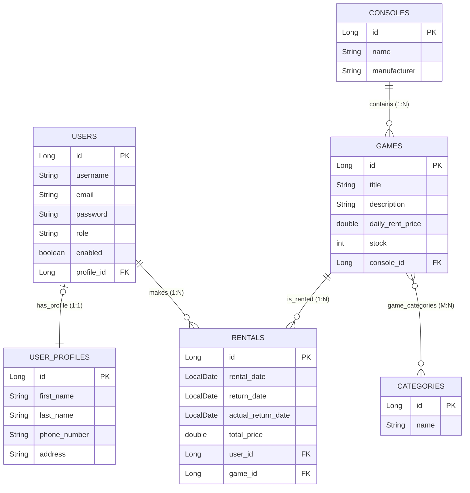

---

## Arhitectura și Configurarea Bazei de Date

Acest proiect utilizează o arhitectură de date multi-mediu pentru a separa strict mediul de dezvoltare de mediul de testare. Astfel, ne asigurăm că rularea testelor automate nu corupe sau șterge datele reale ale aplicației.

* **Baza de Date Principală (Dezvoltare/Producție):** Aplicația rulează pe un server de **MySQL**. Configurarea este realizată în `application-dev.yml`. Aici sunt stocate persistent toate informațiile despre utilizatori, jocuri, console și istoricul închirierilor.
* **Baza de Date pentru Testare (In-Memory):** Pentru testele de integrare și End-to-End, proiectul folosește **H2 Database** (activată prin `@ActiveProfiles("test")` și configurată implicit în `pom.xml` pe scope-ul de test). H2 rulează direct în memoria RAM, oferind o viteză maximă de execuție a testelor, iar datele sunt distruse automat la finalizarea acestora.
* **ORM & Managementul Datelor:** Interacțiunea cu baza de date este gestionată prin **Spring Data JPA** (cu Hibernate ca implementare). Structura tabelelor și relațiile complexe (1:1, 1:N, M:N) sunt generate automat pe baza entităților Java (`@Entity`), eliminând nevoia de scripturi SQL scrise manual.